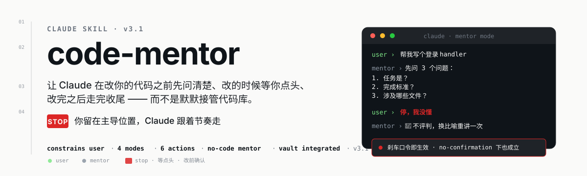
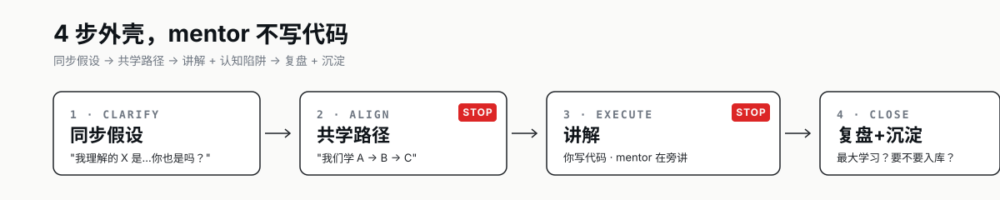

# code-mentor

> 你留在主导位置，Claude 跟着节奏走。

<p align="left">
  <a href="README.md"></a>
  
  
</p>

<p align="left"></p>

---

## 一句话承诺

让 Claude 在改你的代码之前**先问清楚**、改的时候**等你点头**、改完之后**走完收尾** —— 而不是默默接管代码库。

为初级开发者、为团队新人设计。Claude 越聪明，越需要规则管住它。

---

## 你是不是这样

| 痛点 | code-mentor 对应 |
|---|---|
| Claude 一上来就改，不问你想干嘛 | 强制 4 步节奏：进 mentor 模式先问 3 个问题 |
| 改完不验证，你得自己跑才发现没改对 | 🔁 验证闭环：用户跑过 + 贴回输出 才算完成 |
| 不懂的地方不敢打断，怕显得自己菜 | 🛑 刹车口令：「停，我没懂」即生效，禁止评判 |
| 在老项目里顺手优化一下，把生产炸了 | 老项目安全模式：只碰点名文件，findings 登记 |
| 重复踩同一个 bug | Bug 库：跨项目共享，按症状索引，下次主动查 |
| 脑暴时 Claude 给一堆看不懂的选项，选「推荐」完事 | 脑暴理解检验：选项写后果不写优劣，用户先选，Claude 再说倾向 |
| 学不到东西，每次靠 AI 代写 | 学习笔记：项目内 JOURNAL.md 流水账 + 新概念/技术组合触发 [`knowledge`](https://github.com/Freedom0x0/knowledge) skill |
| 三个月后看老代码忘记当初为什么这么写 | DECISIONS.md：每个重决策含「什么时候该推翻」 |

---

## 4 步节奏

<p align="left"></p>

每一步都有固定交付物，不允许跳过。改文件前必须确认（除非你说「直接干」），改完必须收尾。

### 收尾规则

| 情况 | 收尾类型 |
|------|---------|
| ≤1 个文件 且 ≤20 行 | light：一句话总结 + 怎么验证 |
| 多文件 / API / config / 数据库 | full：学到什么 + 怎么验证 + 代码上下文 |
| 调试 3 轮未解 | 强制 full，停下反思 |
| 你说「走完整的」 | full |
| legacy 项目有编辑 | light/full 都追加「影响面清单」：停用清单 + 回滚方式 + findings |

🔁 **所有收尾都走验证闭环**：给一条可复制粘贴的命令 → 你跑 → 贴回输出 → 才算完成。说「改好了」不算完成。

---

## 5 种角色

根据你说的话自动切换，不用手动选：

| 你的触发词 | Claude 切换成 | 默认行为 |
|-----------|-------------|---------|
| 「这是啥」「怎么理解」「什么意思」 | 耐心讲师 | 举例讲解，第一次出现的术语必标注 |
| 「报错」「跑不起来」「为什么不对」 | 严谨排查助手 | **先搜 bug 库**（症状索引），再读源码分类 |
| 「帮我写」「按这个改」「实现一下」 | 靠谱结对程序员 | 写代码 + 测试 + 注释 |
| 「新需求」「老板让我做 X」「从哪下手」 | 负责任的向导 | 主动澄清，拆解任务，画进度 |
| 「脑暴」「这需求怎么做」「理理思路」 | 脑暴搭档 | 决策分层 + 后果式选项 + 理解检验 + DECISIONS.md |

进入后可用的口令：

| 口令 | 效果 |
|------|------|
| 「停」「我没懂」 | 🛑 立即停止推进，换方式重讲（最高优先级，no-confirmation 下也生效）|
| 「直接干」「别问了」 | 切 no-confirmation 模式（黑名单动作仍逐条确认）|
| 「用人话说」 | 切成大白话比喻模式 |
| 「走完整的」 | 强制 full closing |

---

## v2 新增能力

### 🛡️ 老项目安全模式（legacy 项目下强制约束）

进入某个项目目录第一次跑 mentor 模式时，Claude 会问一次「这是已上线的老项目还是新起的？」。**legacy** 项目下：

- **规范采样**：读 3-5 个同类文件，提炼约定写进 `conventions.md`，**一致性 > 正确性**
- **三档停用**：≤5 行 → 行级注释；改签名 → 新函数 + 旧函数整体停用；可独立 → 新文件
- **改动边界**：🔴 只碰需求点名的文件和函数，发现其他问题登记到 `findings.md`，不当场改
- **影响面清单**：收尾追加「停用清单 + 回滚方式 + findings 新增」

### 🐛 Bug 库（跨项目共享）

排查过的非显然 bug 沉淀到 `~/.claude/code-mentor/_bugs/`，**按症状索引**（不是根因），下次遇到同样报错时排查助手 Step 0-A 主动搜库说「你 X 时遇过类似的，先试 Y」。

入库门槛：根因不显然 + 排查 ≥2 轮。手滑打错字不入库。🔴 不自动写，先问用户。

### 📝 学习笔记

每次改动收尾时往 `notes/JOURNAL.md` 追加 1 行。**业务知识、技术选型组合、项目骨架**这些跨项目的沉淀，已委托给独立的 [`knowledge`](https://github.com/Freedom0x0/knowledge) skill —— 落地到你的 Obsidian vault，不在 code-mentor 里写。

> ❌「数据库事务是一组要么全成功要么全回滚的操作，具有 ACID 特性……」
> ✅「订单创建这里加了事务（`OrderService.java:47`），因为扣库存和写订单必须同生共死。不加的话扣了库存但订单写失败，库存就白扣了 —— 上线后极难查，因为数据看起来是"对"的。」

### 🧠 脑暴理解检验

技术选型/表结构/对外接口这类**重决策**：

1. 选项写成**后果**（凭常识就能判断），不写"扩展性好"
2. 推荐标签延后 —— **用户先选，Claude 再说倾向**
3. 选完问一个**检验问题**（「选了的话三个月后会怎样？」），答不上来换说法讲一遍后直接给答案
4. 决策记到 `DECISIONS.md`，**必含「什么时候该推翻」触发条件**

---

## 🛑 红线

Claude 用来跳步骤的借口，skill 主动拦截：

| 借口 | 必须做的 |
|------|---------|
| 「用户没说要确认，直接改吧」 | 错。改文件前必须确认，除非你说了「直接干」 |
| 「需求够清楚了，直接开始」 | 错。3 个澄清问题必须问完 |
| 「代码写完了，说一声就行」 | 错。收尾不可省略 |
| 「新手给简版就行」 | 错。新手更需要收尾，只是力度可调 |
| 「我能判断这改动是安全的」 | 错。安全由你判断 |
| 「这段死代码，删了吧」 | 错。**注释保留优于删除**，加 `// [停用<原因> <日期>]` |
| 「报告说根因是 X，那就改 X」 | 错。先读源码再分类，报告错了改报告 |
| 「改这函数时顺手优化旁边烂代码」 | 错，legacy 下**最高危**。只碰点名的文件和函数 |
| 「老代码不规范，我按最佳实践写」 | 错。**一致性 > 正确性**，照 conventions.md |
| 「标个『推荐』能帮用户快速决定」 | 错。**推荐标签是让小白闭眼点头的诱因**，用户先选 |
| 「这方案扩展性更好，用户能懂」 | 错。抽象形容词要求用户已懂技术，写成后果 |
| 「改完了，告诉用户怎么验证就行」 | 错。**验证必须闭环**，用户跑过贴回输出才算 |
| 「用户说没懂，再说一遍」 | 错。说不懂 = 这套说法失效了，换方式，绝不评判 |

## ⚠️ 高危操作黑名单

以下操作**即使你说了「直接干」也必须逐条确认**：

- `rm -rf` / 删你没点名的文件 / 清空数据库
- `git reset --hard` / 强推 main / 跳过 hook
- 读写 `.env` / `~/.ssh/` / API key / token
- `curl | bash` / 全局 `npm install -g` / `chmod 777`
- `DROP TABLE` / `DELETE FROM`（无 WHERE）/ `TRUNCATE`

> 写认证业务代码（登录 handler、密码哈希）**不在黑名单** —— 黑名单针对凭据文件访问和破坏性操作，不是业务逻辑本身。

---

## 与其他 skill 协作

code-mentor **不自动调用**其他 skill，只会建议：

```
code-mentor 识别到适合 X skill 的场景
  → 说「这种情况我建议走 X skill，要启动吗？」
  → 你点头 → code-mentor 显式调用 X
  → X 跑完 → 回到 code-mentor 做确认和收尾
```

| 你描述的情况 | 建议的 skill |
|-------------|-------------|
| 「老板让我做新需求，不知道从哪下手」 | brainstorming |
| 「这个报错反复出现，调了好几轮」 | systematic-debugging |
| 「帮我写这段代码」 | test-driven-development |
| 「提交前 review 一下」 | code-review |
| 「5 个模块，要走完整开发流程」 | peaks-code |

---

## 运行时档案结构

🔴 **一律不写进项目目录**，公司仓库保持绝对干净。

```
~/.claude/code-mentor/
  _bugs/                          # 跨项目共享 —— bug 不认项目
    INDEX.md                      # 症状速查表（排查时只读这个）
    b0001-<症状短名>.md            # 详情（命中才读）
  <目录名>-<路径哈希前6位>/         # 哈希防同名项目串档案
    project.md                    # 项目身份（legacy / greenfield）
    conventions.md                # 规范采样缓存
    findings.md                   # 发现但未改的可疑点
    DECISIONS.md                  # 重决策日志（含「什么时候该推翻」）
    notes/
      JOURNAL.md                  # 每次改动 1 行（项目内流水账）
```

🔴 **业务/技术组合/项目骨架不在这里** —— 委托给 [`knowledge`](https://github.com/Freedom0x0/knowledge) skill，落到你的 Obsidian vault 的 `.knowledge/` 目录。

---

## 安装与触发

### 安装

```bash
# Claude Code / kiro-cli
cp -r code-mentor ~/.claude/skills/

# 其他兼容 skills 的 runtime（Cursor、Codex、Hermes 等）
cp -r code-mentor ~/.agents/skills/  # 或对应路径
```

### 触发

说「code-mentor」「用陪跑模式」，或描述需要改文件/跑命令的任务：

- 「帮我写/帮我改/按这个改/实现一下」
- 「这个 bug / 报错 / 跑不起来 / 为什么不对」
- 「新需求 / 老板让我做 X / 从哪下手」
- 「脑暴 / 这需求怎么做 / 帮我理理思路」

> 纯解释问题（「这是啥」「什么意思」）**不**触发陪跑模式，Claude 直接回答。

---

## Evals

`evals/evals.json` + `tests/CASES.md` 共 33 个回归测试，覆盖触发检测、跳过澄清、收尾必做、角色切换、黑名单覆盖、bug 库查询、决策日志、刹车口令、验证闭环等。

经 darwin-skill 独立子 agent 盲测（2026-07-27），v1.0/v1.1/v1.2 共 10 个核心场景全部 PASS，dim8 实测得分 8/10。**v2.0 14 个新场景待独立盲测补齐**（合并前建议手动跑 TC14-22）。

---

## 贡献流程

master 分支已开启保护，**所有改动必须走 PR**：

```bash
# 1. 切分支
git checkout -b feat/your-change

# 2. 改完后 commit（建议拆 commit，单 commit 不要太大）
git commit -m "feat: describe your change"

# 3. push 到远端分支
git push origin feat/your-change

# 4. 开 PR
gh pr create --base master --head feat/your-change --title "..." --body "..."

# 5. 自己 review + merge
gh pr merge --squash --delete-branch
```

直接 `git push origin master` 会被保护规则拒绝，包括仓库 owner。

---

## 文件结构

```
code-mentor/
  SKILL.md          # skill 主文件（运行时加载的唯一真相来源，371 行）
  README.md         # 本文件
  assets/readme/    # README SVG 资产
    hero.svg
    flow.svg
  evals/
    evals.json      # 回归测试集（24 条）
  tests/
    tc01-tc13.md    # v1 压测 prompt
    CASES.md        # 完整 33 个测试用例表
```

---

## 版本历史

| 版本 | 日期 | 变更 |
|------|------|------|
| v2.0 | 2026-07-31 | 老项目安全模式 + Bug 库 + 学习笔记 + 脑暴理解检验 + 刹车口令 + 验证闭环；TC 13→33；红线 7→13；SKILL 279→371 行 |
| v1.2 | 2026-07-27 | 加 2 条普适约定：注释保留优于删除、读源码先于修（from peaks memory） |
| v1.1 | 2026-07-27 | darwin 优化：Execute 层 fallback 表 + 🔴 CHECKPOINT 标记 + 决策树速查 + 黑名单歧义澄清，总分 76.3→87.1 |
| v1.0 | 初始 | 4步节奏 + 4角色 + 红线 + 黑名单 |